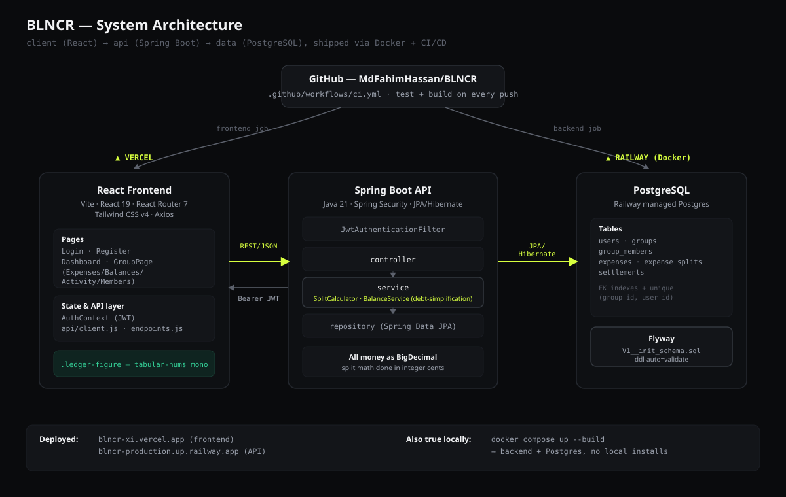

# BLNCR

**Split group expenses fairly. Settle up with the fewest possible payments.**

[](https://github.com/MdFahimHassan/BLNCR/actions/workflows/ci.yml)
[](#tech-stack)
[](#tech-stack)
[](#tech-stack)
[](LICENSE)

**Live app:** [blncr-xi.vercel.app](https://blncr-xi.vercel.app/) · **API:** [blncr-production.up.railway.app](https://blncr-production.up.railway.app/)

---

## The problem

Splitting shared expenses is easy to track and hard to *settle*. A trip with five people and thirty expenses doesn't produce one debt — it produces a tangled web of small IOUs, and untangling it by hand is where every spreadsheet-based tracker gives up. Most expense splitters stop at listing who owes what. BLNCR treats the group's debts as a graph and simplifies them down to the **minimum number of payments** needed to zero everyone out — the same category of problem used in real-world settlement and netting systems.

## Demo

<!--
  Add a short screen-capture here before sharing this README with recruiters:
  1. Record a 20–40s walkthrough (register → create group → add an expense → balances → settle up).
  2. Convert to a GIF (e.g. `gifski` or Kap on macOS, ScreenToGif on Windows) — keep it under ~8MB.
  3. Save it as docs/demo.gif and swap in the line below.
-->
`docs/demo.gif` — *(record and drop the walkthrough GIF here; see comment in the README source)*

[▶ Try the live app](https://blncr-xi.vercel.app/) — fastest way to see it working end to end.

## Features

- **Group expense tracking** — create groups, add members, log shared expenses
- **Flexible splitting** — equal, exact-amount, or percentage-based splits
- **Smart balance calculation** — real-time view of who owes whom
- **Debt simplification engine** — minimizes the total number of settle-up transactions in a group
- **Settlement tracking** — mark debts as paid, keep a running activity history
- **Precise financial math** — every monetary value is a `BigDecimal`, split in integer cents, never a `float`/`double`

## Tech stack

| Layer | Choices |
|---|---|
| **Backend** | Java 21 · Spring Boot 4.1 · Spring Security · Spring Data JPA (Hibernate 7) · Maven |
| **Auth** | JWT (stateless, custom filter + `UserDetailsService`) |
| **Database** | PostgreSQL 18 · Flyway migrations |
| **Frontend** | React 19 · Vite · React Router 7 · Tailwind CSS v4 · Axios |
| **Testing** | JUnit 5 · Mockito · AssertJ · `@DataJpaTest` / `@WebMvcTest` / `@SpringBootTest` (H2) |
| **Infra** | Docker (multi-stage build) · Docker Compose · GitHub Actions CI · Railway (API + Postgres) · Vercel (frontend) |

## Architecture

<p align="center">
  
</p>

The backend follows a strict `controller → service → repository` layering. The two algorithmically interesting pieces — **`SplitCalculator`** (equal/exact/percentage split math) and **`BalanceService`** (net balances + debt simplification) — live entirely in the service layer with no framework or persistence code mixed in, so they're unit-testable in isolation and reusable if the transport layer ever changes (e.g. adding a GraphQL or gRPC front door later).

<details>
<summary>Plain-text fallback diagram</summary>

```
┌─────────────┐      REST/JSON        ┌──────────────────┐      JPA/Hibernate      ┌──────────────┐
│   React     │ ────────────────────▶ │   Spring Boot     │ ─────────────────────▶ │  PostgreSQL  │
│  (Vercel)   │ ◀──────────────────── │  API (Railway,    │ ◀───────────────────── │  (Railway    │
│             │      Bearer JWT       │   Docker)          │                          │  managed)   │
└─────────────┘                       └──────────────────┘                          └──────────────┘
       ▲                                        ▲
       │              GitHub Actions CI (test + build, gates both deploys)
       └────────────────────┬───────────────────┘
                    github.com/MdFahimHassan/BLNCR
```
</details>

## Key design decisions

- **`BigDecimal`, split in integer cents — never `float`/`double`.** Floating-point division doesn't distribute cleanly (splitting $100 three ways is the classic failure case). `SplitCalculator` converts to cents, does integer division, and distributes any leftover cent by the **largest-remainder method** so splits always sum back exactly to the total and cents go to the largest fractional share rather than whoever's listed first.
- **Debt simplification is a deliberate, named trade-off.** True minimum-transaction debt netting is NP-hard in the general case. `BalanceService` uses the standard greedy heuristic — repeatedly matching the largest creditor with the largest debtor — which isn't provably optimal for every input but produces a short, clean settle-up plan in practice and is the accepted approach for a project at this scope.
- **JWT over server-side sessions.** A stateless token fits a REST API consumed by a fully decoupled SPA, and avoids pinning the backend to sticky sessions if it's ever scaled horizontally.
- **Layered architecture, with a shared `GroupAccessService`.** Every group-scoped endpoint (expenses, balances, settlements, activity) needs the same "does this group exist, is this user a member" check; factoring it out once meant four services stayed thin instead of repeating that guard clause.
- **Flyway over `ddl-auto=update`, and specifically `spring-boot-starter-flyway`.** Versioned SQL migrations are reviewable and reversible in a way Hibernate's auto-DDL isn't. Worth noting for anyone hitting the same wall: on Spring Boot 4, the plain `flyway-core` + `flyway-database-postgresql` combo (correct on Boot 3.x) compiles fine but never actually runs — Boot 4 moved Flyway's autoconfiguration into `spring-boot-starter-flyway`, and without it migrations silently don't fire while `ddl-auto=validate` fails against an empty schema with no error pointing at the real cause.
- **Secrets are environment-only.** `JWT_SECRET` has no fallback anywhere in the codebase — the app fails fast on boot if it isn't set, rather than quietly running with a checked-in default.

## Getting started

### Prerequisites
- Java 21+ · Maven · Docker (for PostgreSQL) · Node.js + npm

### Run everything with Docker (recommended)
```bash
cp .env.example .env   # fill in JWT_SECRET (openssl rand -base64 64) and a real DB_PASSWORD
docker compose up --build
```
API is then live at `http://localhost:9090`.

### Run backend + frontend separately
```bash
# Postgres
docker run --name blncr-db -e POSTGRES_PASSWORD=yourpassword -e POSTGRES_DB=blncr -p 5432:5432 -d postgres

# Backend — configure src/main/resources/application.properties, then:
./mvnw spring-boot:run

# Frontend
cd frontend
npm install
npm run dev
```

### Run the tests
```bash
./mvnw test
```

## Roadmap

- [x] Data model & entity design
- [x] Backend foundation (Spring Boot + PostgreSQL + JPA + JWT auth)
- [x] Expense & split logic, **debt simplification algorithm**
- [x] React frontend (Vite + Tailwind)
- [x] Automated test suite (JUnit + Mockito + repository/integration tests)
- [x] Dockerized backend + Postgres, Flyway migrations, GitHub Actions CI
- [x] Live deploy — Railway (backend + managed Postgres) and Vercel (frontend)
- [x] Polish for recruiters — architecture diagram, sharp README, project write-up
- [ ] Demo GIF embedded above *(record locally — see the comment in the README source)*
- [ ] Custom domain *(optional)*
- [ ] Stretch: recurring expenses, multi-currency, receipt uploads, category charts

See [`Progress.md`](Progress.md) for the full build log, and [`docs/PROJECT_WRITEUP.md`](docs/PROJECT_WRITEUP.md) for a portfolio-ready write-up of this project.

## License

MIT