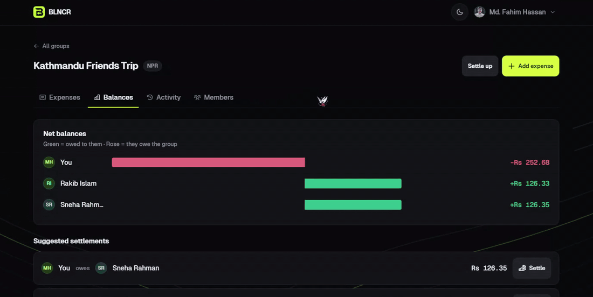
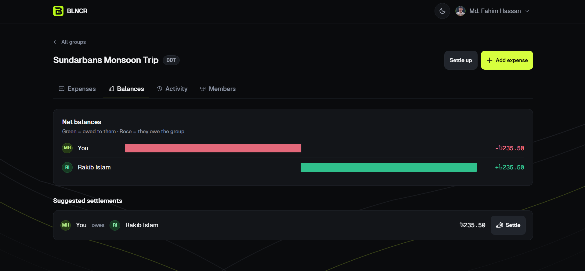
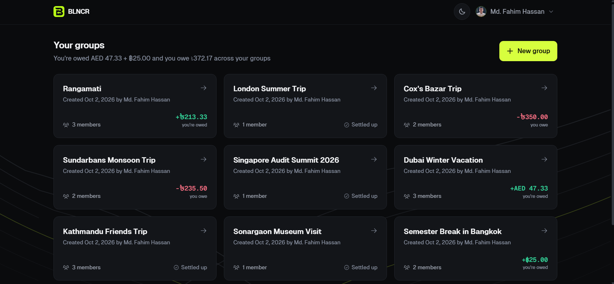
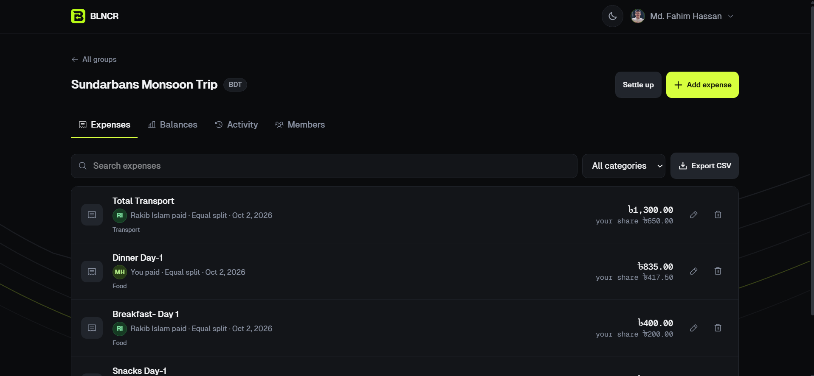
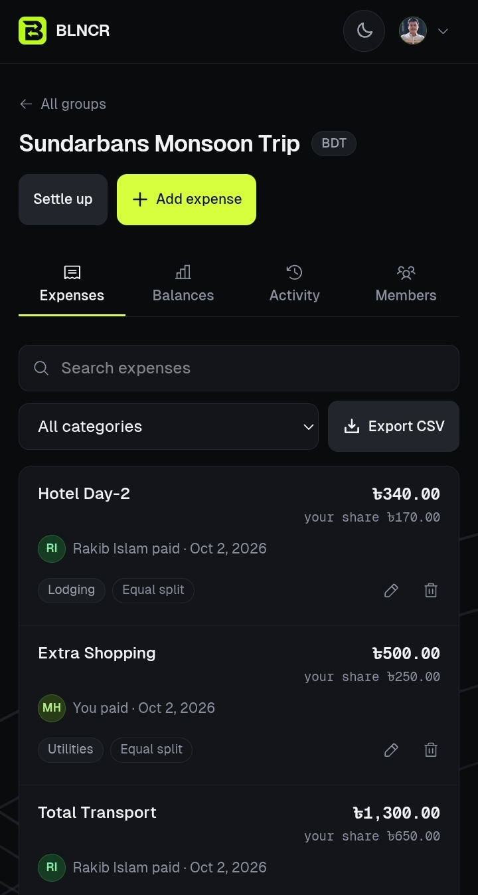
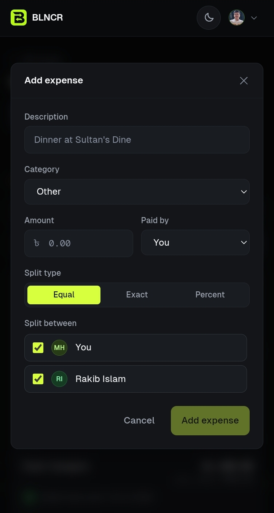
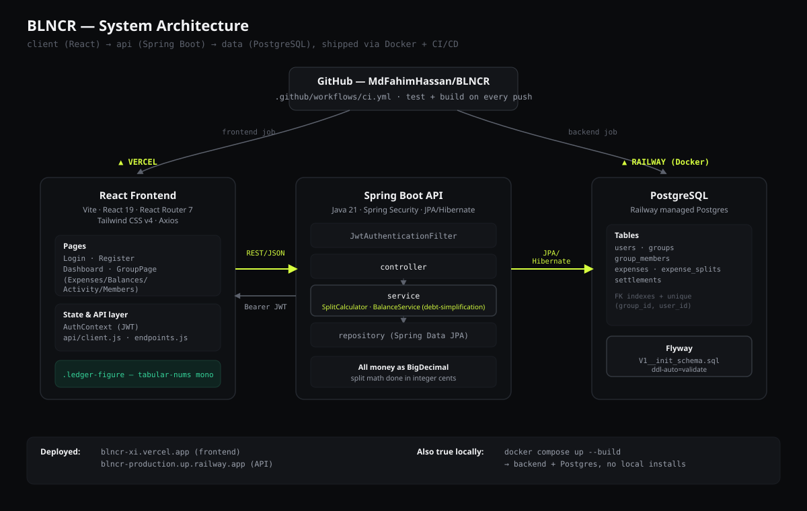

# BLNCR

**Split group expenses fairly. Get a compact plan to settle up.**

[](https://github.com/MdFahimHassan/BLNCR/actions/workflows/ci.yml)
[](#tech-stack)
[](#tech-stack)
[](#tech-stack)
[](LICENSE)

**Live app:** [blncr-xi.vercel.app](https://blncr-xi.vercel.app/) · **API:** [blncr-production.up.railway.app](https://blncr-production.up.railway.app/)

---

## The problem

Splitting shared expenses is easy to track and hard to *settle*. A trip with five people and thirty expenses doesn't produce one debt — it produces a tangled web of small IOUs, and untangling it by hand is where every spreadsheet-based tracker gives up. Most expense splitters stop at listing who owes what. BLNCR treats the group's debts as a graph and uses a greedy heuristic to produce a compact payment plan that zeros everyone out. It often reduces the number of payments, but doesn't guarantee the mathematical minimum.

## Demo

<p align="center">
  
</p>

[▶ Try the live app](https://blncr-xi.vercel.app/): fastest way to see it working end to end. If the API has been idle, the first request can be slow while the container wakes up (depends on the hosting tier).

<p align="center">
  <br>
  <sub><b>Balances</b>: net position per member and a compact payment plan</sub>
</p>

<table>
  <tr>
    <td width="50%"></td>
    <td width="50%"></td>
  </tr>
  <tr>
    <td><sub><b>Dashboard</b>: every group and your balance in it, from one API call</sub></td>
    <td><sub><b>Expenses</b>: equal, exact and percentage splits, categories, search</sub></td>
  </tr>
</table>

<table align="center">
  <tr>
    <td align="center"></td>
    <td align="center"></td>
  </tr>
  <tr>
    <td align="center"><sub><b>Mobile</b>: built phone-first, checked at 360px wide</sub></td>
    <td align="center"><sub><b>Add expense</b>: equal, exact or percent splits</sub></td>
  </tr>
</table>

## Features

**Splitting and settling**
- **Flexible splits**: equal, exact-amount, or percentage, with eight expense categories
- **Edit and delete expenses** (by the creator or a group admin), with search, category filter and paging in the UI
- **Balances and debt simplification**: net position per member plus a greedy heuristic that produces a compact settle-up plan; it does not guarantee the mathematical minimum
- **Settlements and activity feed**: record a payment you were part of, and keep a running history
- **Precise financial math**: every monetary value is a `BigDecimal`, split in integer cents, never a `float`/`double`
- **Multi-currency groups**: pick one of 20 currencies per group

**Groups and accounts**
- **Invite links**: single-use, 7-day expiry, stored only as SHA-256 hashes (no "add anyone by email" endpoint, so no account enumeration)
- **Roles**: owner, admin and member, with ownership transfer, member removal, leaving and group deletion
- **Settle before you leave**: leaving, removal and account deletion are blocked while a balance is unsettled, so nobody's debt gets stranded
- **Profile and privacy**: avatar upload (JPEG/PNG/WebP, magic-byte checked), edit profile, and account deletion that anonymizes the user while keeping group ledgers intact

**Engineering**
- **Idempotent writes**: expense creation takes an `Idempotency-Key`, so a double-click or flaky retry can't create a duplicate
- **Correct time handling**: timestamps are UTC instants (`TIMESTAMPTZ`), shown in each viewer's local time
- **Operations-ready API**: liveness/readiness probes, request IDs, structured JSON logs, optional Sentry error tracking, and OpenAPI docs

## Tech stack

| Layer | Choices |
|---|---|
| **Backend** | Java 21 · Spring Boot 4.1 · Spring Security · Spring Data JPA (Hibernate 7) · Maven |
| **Auth** | JWT (stateless, custom filter + `UserDetailsService`), BCrypt, server-side token revocation |
| **Database** | PostgreSQL 18 · Flyway migrations |
| **Frontend** | React 19 · Vite · React Router 7 · Tailwind CSS v4 · Axios |
| **Testing** | JUnit 5 · Mockito · AssertJ · `@DataJpaTest` / `@WebMvcTest` / `@SpringBootTest` (H2) · Testcontainers (real Postgres) · Vitest + Testing Library · Playwright (end-to-end) |
| **Observability** | Spring Actuator probes · request-ID logging · Sentry (opt-in) · springdoc OpenAPI |
| **Infra** | Docker (multi-stage build) · Docker Compose · GitHub Actions CI · Railway (API + Postgres) · Vercel (frontend) |

## Operations and security notes

- Docker health is based on `/actuator/health/readiness`; `/actuator/health/liveness` and `/actuator/health/readiness` are the only public Actuator endpoints. Health details are not exposed.
- Every response includes `X-Request-ID`. Safe caller-provided IDs are retained; invalid or missing values are replaced with a generated UUID. Console logs are structured JSON and include the request ID.
- Set `SENTRY_DSN` in the deployment secret store to enable error reporting. Sentry is disabled when no DSN is configured and `send-default-pii` is off.
- The browser stores JWTs in `localStorage`, which is convenient for this standalone SPA but makes script injection a token-theft risk. The API's restrictive CSP and lack of third-party scripts reduce exposure, but do not make browser storage equivalent to an `HttpOnly` cookie.
- Login throttling and token revocation are in-memory and single-instance only; counters reset on restart and revocations do not synchronize across replicas. Use a shared store (such as Redis) or edge rate limiting before horizontal scaling.
- API docs are available at `/swagger-ui.html` and `/v3/api-docs`.

## Architecture

<p align="center">
  
</p>

The backend follows a strict `controller → service → repository` layering. The two algorithmically interesting pieces — **`SplitCalculator`** (equal/exact/percentage split math) and **`BalanceService`** (net balances + debt simplification) — live entirely in the service layer with no framework or persistence code mixed in, so they're unit-testable in isolation and reusable if the transport layer ever changes (e.g. adding a GraphQL or gRPC front door later).

<details>
<summary>Plain-text fallback diagram</summary>

```
┌─────────────┐      REST/JSON        ┌──────────────────┐      JPA/Hibernate      ┌──────────────┐
│   React     │ ────────────────────▶ │   Spring Boot     │ ─────────────────────▶ │  PostgreSQL  │
│  (Vercel)   │ ◀──────────────────── │  API (Railway,    │ ◀───────────────────── │  (Railway    │
│             │      Bearer JWT       │   Docker)          │                          │  managed)   │
└─────────────┘                       └──────────────────┘                          └──────────────┘
       ▲                                        ▲
       │              GitHub Actions CI (test + build, gates both deploys)
       └────────────────────┬───────────────────┘
                    github.com/MdFahimHassan/BLNCR
```
</details>

## Key design decisions

- **`BigDecimal`, split in integer cents — never `float`/`double`.** Floating-point division doesn't distribute cleanly (splitting $100 three ways is the classic failure case). `SplitCalculator` converts to cents, does integer division, and distributes any leftover cent by the **largest-remainder method** so splits always sum back exactly to the total and cents go to the largest fractional share rather than whoever's listed first.
- **Debt simplification is a deliberate, named trade-off.** True minimum-transaction debt netting is NP-hard in the general case. `BalanceService` uses the standard greedy heuristic — repeatedly matching the largest creditor with the largest debtor — which isn't provably optimal for every input but produces a short, clean settle-up plan in practice and is the accepted approach for a project at this scope.
- **JWT over server-side sessions.** A stateless token fits a REST API consumed by a fully decoupled SPA, and avoids pinning the backend to sticky sessions if it's ever scaled horizontally.
- **Layered architecture, with a shared `GroupAccessService`.** Every group-scoped endpoint (expenses, balances, settlements, activity) needs the same "does this group exist, is this user a member" check; factoring it out once meant four services stayed thin instead of repeating that guard clause.
- **Flyway over `ddl-auto=update`, and specifically `spring-boot-starter-flyway`.** Versioned SQL migrations are reviewable and reversible in a way Hibernate's auto-DDL isn't. Worth noting for anyone hitting the same wall: on Spring Boot 4, the plain `flyway-core` + `flyway-database-postgresql` combo (correct on Boot 3.x) compiles fine but never actually runs — Boot 4 moved Flyway's autoconfiguration into `spring-boot-starter-flyway`, and without it migrations silently don't fire while `ddl-auto=validate` fails against an empty schema with no error pointing at the real cause.
- **Secrets are environment-only.** `JWT_SECRET` has no fallback anywhere in the codebase — the app fails fast on boot if it isn't set, rather than quietly running with a checked-in default.

## Getting started

### Prerequisites
- Java 21+ · Maven · Docker (for PostgreSQL) · Node.js + npm

### Run everything with Docker (recommended)
```bash
cp .env.example .env   # fill in JWT_SECRET (openssl rand -base64 64) and a real DB_PASSWORD
docker compose up --build
```
API is then live at `http://localhost:9090`.

### Run backend + frontend separately
```bash
# Postgres
docker run --name blncr-db -e POSTGRES_PASSWORD=yourpassword -e POSTGRES_DB=blncr -p 5432:5432 -d postgres

# Backend — configure src/main/resources/application.properties, then:
./mvnw spring-boot:run

# Frontend
cd frontend
npm install
npm run dev
```

### Run the tests
```bash
# Backend: unit, repository, MockMvc integration (H2). The Postgres migration test
# uses Testcontainers and is skipped automatically when Docker isn't available.
./mvnw verify

# Frontend: unit/component tests and lint
cd frontend
npm test
npm run lint

# Browser end-to-end flow (needs the backend running, e.g. `docker compose up -d --build backend`)
npx playwright install chromium
npm run test:e2e
```
CI runs all of the above on every push.

### Regenerate the README screenshots and demo
With the backend running, one command seeds a realistic group through the API and captures every image above:
```bash
cd frontend
npx playwright test -c playwright.capture.config.js
# writes docs/screenshots/*.png and docs/demo.webm (convert to GIF with the ffmpeg line it prints)
```

## Known limitations

These are deliberate scope decisions, listed so they're not surprises:

- **Debt simplification is a heuristic.** Greedy largest-creditor/largest-debtor matching is short and readable but not provably minimal; true minimum-transaction netting is NP-hard.
- **Rate limiting and token revocation are in-memory.** They reset on restart and don't sync across replicas; a shared store (Redis) or edge limiting is needed before scaling out.
- **The JWT lives in `localStorage`.** The strict CSP and lack of third-party scripts limit exposure, but an `HttpOnly` cookie plus CSRF protection would be stronger. Tokens last an hour and there is no refresh flow, so users sign in again after expiry.
- **List endpoints aren't paginated server-side.** Search, filtering and paging happen in the browser, which is fine for friend-group scale but not for thousands of expenses per group.
- **Settlements can't be undone or edited**, and overpayments aren't rejected.
- **No password reset or email verification.** Email addresses are validated (format, disposable and reserved domains, MX lookup) but not confirmed.

## What I'd do next

- Server-side pagination and CSV export for expenses
- Refresh tokens with `HttpOnly` cookies, and Redis-backed rate limiting
- Settlement reversal, and an exact debt-simplification solver for small groups (subset-partition DP, greedy fallback for larger ones)
- Password reset and email verification
- Recurring expenses, receipt uploads, and category charts

## Roadmap

- [x] Data model & entity design
- [x] Backend foundation (Spring Boot + PostgreSQL + JPA + JWT auth)
- [x] Expense & split logic, **debt simplification algorithm**
- [x] React frontend (Vite + Tailwind)
- [x] Automated tests at every layer (unit, repository, integration, Postgres/Testcontainers, component, browser end-to-end)
- [x] Dockerized backend + Postgres, Flyway migrations, GitHub Actions CI
- [x] Live deploy: Railway (backend + managed Postgres) and Vercel (frontend)
- [x] Product depth: invites, roles, edit/delete, categories, multi-currency, profile and account deletion
- [x] Production hygiene: health probes, request IDs, structured logs, Sentry, OpenAPI
- [ ] Custom domain *(optional)*

See [`Progress.md`](Progress.md) for the full build log, and [`docs/PROJECT_WRITEUP.md`](docs/PROJECT_WRITEUP.md) for a portfolio-ready write-up of this project.

## License

MIT